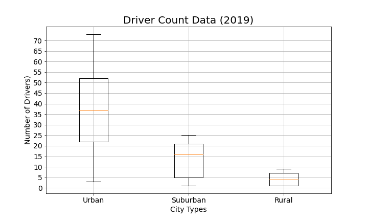
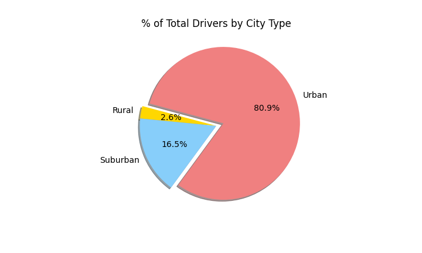

# PyBer_Analysis

## Overview of the Project

### Purpose 
The goal of the project is to analyze the data of Pyber ride and share project and create multiple graphs to show the relationship between city type and to the rides, average fares, drivers associated. Pyber operates in 3 city types Urban, Suburban and Rural. 

The datas were stored in city_data.csv and ride_data_csv and it has city,date,fare,ride_id,driver_count,type columns and its values.

### Initial Analysis
After intital reviewing and cleaning up process for the 2 datasets, we merged the 2 data sets by using city as its common field.

On the new merged dataframe,

•Created Bubble Chart that showcases the average fare versus the total number of rides with bubble size based on the total number of drivers for each city type.

•Created Box-and-Whisker plots that visualizes the number of rides for each city type, the fares for each city type, the number of drivers for each city type. 

•Created a Pie chart that visualizes the percent of total fares, the percent of total rides, the percent of total drivers.

[PyBer](PyBer.ipynb) - Initial Analysis on Pyber ride and share data.

### Updated Analysis 

The purpose of this analysis is to create multiple-line graph that shows the total weekly fares for each city type.

[PyBer Challenge](Pyber_Challenge.ipynb) - Updated Analysis on Pyber ride and share data.

## Result

From the merged dataframe,we gathered data related to total rides,total fares,total drivers and calculated the average fare per ride and average fare per driver for  each city type. 
Below is the summary dataframe created based on the data gathered.

From the summary dataframe,we can see that there is a trend between how populated city is and the total number of rides,which will affect the total drivers,total fares,average fare per ride and average fare per driver. Though the total number of rides,drivers and fares decrease  in less populated cities but the avergae fare per ride and average fare per drive seems to increase.

Creating multiple-line chart for total fare of each city type would be an option to analyze the data further.Inorder to acheive this, we first created a pivot table from the dataframe with date as the index and each city types as columns and fares as values.

next, a new DataFrame was created using the "resample()" function by week 'W' and get the sum of the fares for each week.

the multiple-line graph was then created to show the total fare by each city type. 

With the above multiple-line chart, we are able to see the total fares by each city type form Jan to May.The number of rides seem to increase closer to March and keeps fluctuating during  March and also theres is a sharp increase in rides for Suburban city during April where other city seems to have a decrease trend.   

## Summary 

First, the total fare by city type for the suburban cities seem to  have increased in April, the company could analyze as to what caused the increase where the other city type seem to have a decrease in trend.

Next, the average fare per ride and average fare per driver is higher when driver count is less. The comapny can increase the driver count during a certain time to reach the profit. 

Last, the average fare per ride shows increase from more populated cities to less populated cites but the average fare per driver increases drastically from populated cities to less populated cities. The company could allocate more drivers to less populated cites like rural to reach the profit. 

